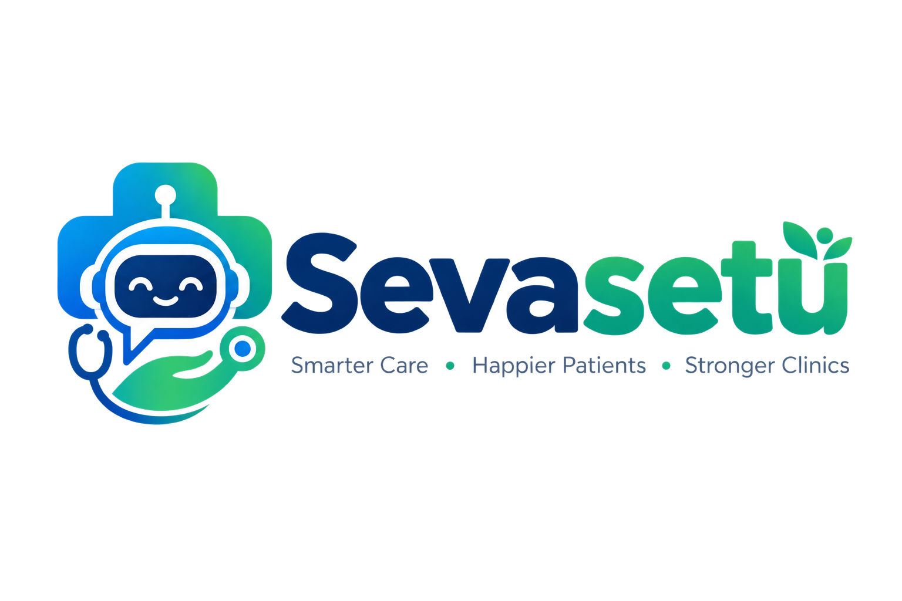

# SevaSetu AI - Healthcare Access Platform

<p align="center">
  
</p>

<p align="center">
  <strong>Democratizing Clinical Guidance, Scheme Eligibility, and Emergency Preparedness for Bharat</strong>
</p>

<p align="center">
  <a href="https://fastapi.tiangolo.com"></a>
  <a href="https://react.dev"></a>
  <a href="https://vitejs.dev"></a>
  <a href="https://www.typescriptlang.org/"></a>
  <a href="https://python.org"></a>
  <a href="https://supabase.com"></a>
  <a href="https://qdrant.tech"></a>
  <a href="https://groq.com"></a>
  <a href="https://railway.com"></a>
  <a href="https://vercel.com"></a>
</p>

---

## Executive Summary

**SevaSetu AI** is an intelligent, low-bandwidth healthcare platform designed to bridge medical access disparities in rural and semi-urban India. Built with a dual-experience architecture (executive clinical SaaS on desktop and a high-performance Progressive Web App on mobile), the platform provides real-time multilingual voice triage, AI-driven medical report analysis, an interactive government welfare eligibility calculator, and a 100% offline emergency first-aid pocketbook.

---

## Key Capabilities

- **Multilingual Voice & Chat Triage**: Real-time clinical guidance with automatic language switching across English, Hindi (हिन्दी), Telugu (తెలుగు), and Odia (ଓଡ଼ିଆ), supporting bidirectional speech-to-text (STT) and speech synthesis (TTS).
- **Medical Report & Lab Analysis**: Client-side image compression (<500 KB Canvas pipeline in ~50 ms) paired with Vision OCR and LLM-driven interpretation, generating plain-language health metrics and flagged parameters.
- **Smart Government Scheme Eligibility Wizard**: 3-step interactive assessment calculating instant qualification for Ayushman Bharat (PM-JAY), BSKY, Aarogyasri, MJPJAY, and specialized maternal schemes.
- **100% Offline Emergency First-Aid Pocketbook**: Standalone, network-independent emergency protocols (snakebites, heatstroke, severe burns, poisoning, CPR) with direct cellular telephone dialers for National Ambulance (108) and Health Help (104).
- **Clinical Outpatient & Telemedicine Scheduling**: Appointment booking engine supporting both in-person visits (PHC, CHC, District Civil Hospital) and virtual telemedicine with Ayushman ABHA fast-track queue tokens.
- **District Health Knowledge Hub**: Community health library with real-time disease vigilance advisories, vaccination timetables, hygiene guidelines, and downloadable regional resources.
- **Spotlight Command Palette**: Global keyboard-driven search (`Ctrl + K` / `Cmd + K`) for instant navigation across medical terms, doctor profiles, and emergency workflows.

---

## System Architecture

```mermaid
graph TD
    User([Citizen / Healthcare Worker]) -->|Interacts via Voice, Chat, or Upload| Client[React 18 PWA + Vite (Vercel)]
    Client -->|Client-Side Compression| CanvasEngine[HTML5 Canvas Pipeline (<500KB)]
    CanvasEngine -->|Compressed Payload| APIGateway[FastAPI Gateway (Railway)]
    
    APIGateway -->|Clinical Reasoning & Triage| GroqLLM[Groq LPU Cloud (LLaMA-3.3-70B / Scout-17B)]
    APIGateway -->|Hybrid Semantic Search| Qdrant[Qdrant Cloud Vector Cluster]
    APIGateway -->|Relational Data & Auth| Supabase[(Supabase PostgreSQL Pooler)]
    APIGateway -->|Secure Medical Records| Cloudinary[(Cloudinary Encrypted Storage)]
    
    Client -.->|Zero-Network Fallback| ServiceWorker[PWA Service Worker Cache (sevasetu-v3)]
    ServiceWorker -.->|Offline Life-Saving Protocols| LocalPocketbook[(Offline First-Aid Database)]
```

---

## Technology Stack

| Layer | Technologies |
|---|---|
| **Frontend Web & PWA** | React 18, TypeScript, Vite, Tailwind CSS, Lucide Icons, Service Worker API |
| **Backend API** | FastAPI (Python 3.11), Pydantic v2, Uvicorn, SQLAlchemy |
| **AI Inference** | Groq Cloud LPU (`llama-3.3-70b-versatile`, `meta-llama/llama-4-scout-17b-16e-instruct`) |
| **Vector Database & RAG** | Qdrant Cloud Cluster (Dense embeddings + Keyword token boosting) |
| **Primary Database** | PostgreSQL 15 via Supabase Session Pooler |
| **Document Storage** | Cloudinary CDN with signed access tokens |
| **Infrastructure & Hosting** | Vercel (Edge CDN Frontend), Railway (Containerized Backend) |

---

## Repository Structure

```text
Health-AIChatbot/
├── assets/                         # Production brand identity and vector logos
│   ├── sevasetu-icon.png           # Master square application icon
│   └── sevasetu-logo.png           # Master horizontal brand logo
│
├── AI-Health-Chatbot-n8n-main/    # Frontend Application (React + Vite)
│   ├── public/                     # PWA manifest, service worker (sw.js), icons
│   ├── src/
│   │   ├── components/             # Reusable UI components & layouts
│   │   ├── contexts/               # Auth, Language, Notification, Theme contexts
│   │   ├── data/                   # Offline first-aid protocols & scheme datasets
│   │   ├── hooks/                  # Voice synthesis, recognition, PWA install hooks
│   │   ├── pages/                  # Chat, Reports, Schemes, Appointments, Health Hub
│   │   ├── services/               # API clients (analysis, schemes, appointments)
│   │   └── utils/                  # Client-side canvas image compressor
│   ├── index.html                  # HTML entry point with PWA meta tags
│   ├── package.json
│   └── vite.config.ts
│
├── backend/                        # Backend Application (FastAPI)
│   ├── alembic/                    # Database migration scripts
│   ├── app/
│   │   ├── config/                 # Pydantic environment settings & DB engine
│   │   ├── models/                 # SQLAlchemy ORM models (User, Report, etc.)
│   │   ├── routes/                 # API endpoints (chat, analysis, schemes, appointments)
│   │   ├── services/               # Groq AI, Qdrant vector, and Cloudinary integrations
│   │   └── utils/                  # JWT security and authentication helpers
│   ├── Dockerfile                  # Container definition for production deployment
│   ├── Procfile                    # Railway start process configuration
│   └── requirements.txt            # Python dependencies
│
└── README.md                       # Repository documentation
```

---

## Environment Configuration

### Backend Configuration (`backend/.env`)

```env
# Application Settings
APP_NAME="SevaSetu AI Health Assistant"
DEBUG=False
ALLOWED_ORIGINS="https://*.vercel.app,http://localhost:5173,http://localhost:8080"

# Database Connection (Supabase PostgreSQL)
DATABASE_URL="postgresql+psycopg2://<user>:<password>@<host>:5432/postgres?sslmode=require"

# Groq AI Inference
GROQ_API_KEY="gsk_your_groq_api_key"
AI_MODEL="llama-3.3-70b-versatile"
VISION_MODEL="meta-llama/llama-4-scout-17b-16e-instruct"

# Qdrant Cloud Vector Database
QDRANT_URL="https://your-cluster.qdrant.tech:6333"
QDRANT_API_KEY="your_qdrant_api_key"

# Cloudinary Storage
CLOUDINARY_CLOUD_NAME="your_cloud_name"
CLOUDINARY_API_KEY="your_api_key"
CLOUDINARY_API_SECRET="your_api_secret"

# JWT Authentication
SECRET_KEY="your-secure-random-secret-key"
ALGORITHM="HS256"
ACCESS_TOKEN_EXPIRE_MINUTES=60
```

### Frontend Configuration (`AI-Health-Chatbot-n8n-main/.env`)

```env
# Production FastAPI Gateway URL
VITE_API_BASE_URL="https://healthaichatbot-leadsphere-production-0990.up.railway.app/api"
```

---

## Local Development Setup

### Prerequisites
- Python 3.11 or higher
- Node.js 18 or higher with npm
- Git

### Backend Setup

```bash
cd backend

# 1. Create and activate a Python virtual environment
python -m venv .venv
source .venv/bin/activate    # On Windows: .venv\Scripts\Activate.ps1

# 2. Install dependencies
pip install -r requirements.txt

# 3. Apply database migrations
alembic upgrade head

# 4. Start the FastAPI development server
uvicorn app.main:app --reload --port 8000
```

API documentation will be accessible at `http://localhost:8000/docs`.

### Frontend Setup

```bash
cd AI-Health-Chatbot-n8n-main

# 1. Install dependencies
npm install

# 2. Start the Vite development server
npm run dev
```

The application will be accessible at `http://localhost:8080`.

---

## Deployment Workflow

### Backend Deployment (Railway)
1. Push repository changes to GitHub.
2. In Railway, configure the **Root Directory** as `/backend`.
3. Populate all environment variables from `backend/.env.production`.
4. Deploy the service and note the generated production URL.
5. Verify health check at `https://<YOUR-RAILWAY-URL>/` (returns HTTP 200 `{"status": "ok"}`).

### Frontend Deployment (Vercel)
1. In Vercel, import the repository and set the **Root Directory** to `AI-Health-Chatbot-n8n-main`.
2. Ensure framework preset is **Vite** with build command `npm run build` and output directory `dist`.
3. Set environment variable `VITE_API_BASE_URL` to `https://<YOUR-RAILWAY-URL>/api`.
4. Trigger production build and deployment.

---

## Clinical Safety & Disclaimer

SevaSetu AI provides preliminary clinical guidance, automated welfare scheme matching, and verified first-aid instructions based on published medical literature. It is not a replacement for professional clinical judgment, emergency trauma diagnosis, or hospital treatment. In life-threatening emergencies (chest pain, acute breathing distress, severe trauma, or unconsciousness), individuals must immediately contact the National Emergency Ambulance Service at **108** or proceed to the nearest emergency room.

---

## License

This project is licensed under the **MIT License**. See the [LICENSE](LICENSE) file for complete details.
