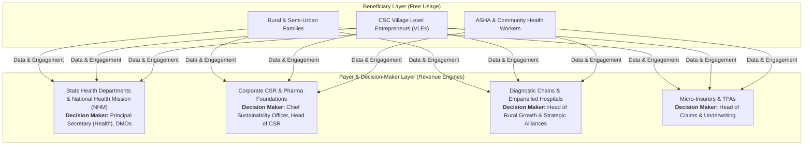
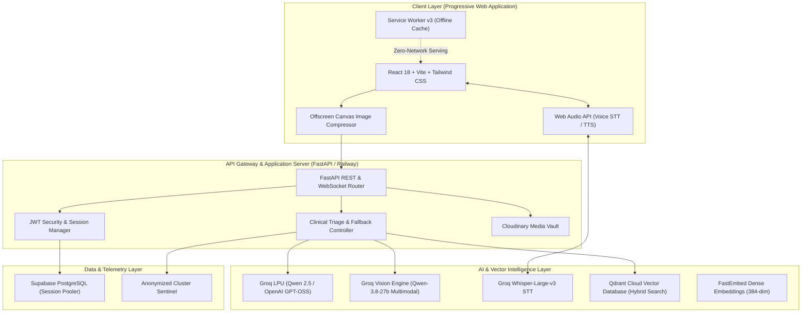
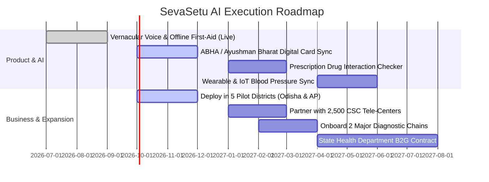

# SevaSetu AI — BITSoM Vertex Master Application Dossier & Pitch Document

---

## 1. Startup Snapshot

### 1.1 What does your startup do?
**SevaSetu AI** is Bharat’s offline-first, multilingual healthcare intelligence platform and public health sentinel. We convert every budget smartphone into an AI medical interpreter, 100% offline emergency first-aid pocketbook, and government welfare scheme navigator. 

Specifically, SevaSetu AI:
1. **Translates & Interprets Complex Diagnostics**: Allows citizens to photograph blood reports, prescriptions, or X-rays and receive instant, plain-language explanations in vernacular languages (Hindi, Telugu, Odia, Marathi, English).
2. **Navigates Healthcare Welfare**: Features a 30-second interactive eligibility calculator matching rural and low-income families to Central & State health schemes (Ayushman Bharat PM-JAY, BSKY, Aarogyasri, MJPJAY, JSY) with exact document checklists and empanelled hospital links.
3. **Saves Lives in No-Signal Zones**: Delivers a zero-network, 100% offline emergency first-aid pocketbook with clinically verified DOs and strict DONTs (snake bites, burns, CPR, heat stroke) and 1-tap direct GSM cellular dialers (`108`, `104`, `112`).
4. **Protects Communities**: Aggregates anonymized, localized consultation telemetry to provide early warning alerts for district epidemic outbreaks (Dengue, Malaria, viral fever).

### 1.2 What milestone best represents your progress so far?
We have achieved a **fully functioning, end-to-end deployed production platform** consisting of:
- **Live Multilingual Web & Native PWA App** deployed on Vercel with offline service workers, client-side Canvas image compression (`<400KB` in `<50ms`), and a global `Ctrl+K` Spotlight Command Palette.
- **Sub-Second AI Backend** deployed on Railway with FastAPI, connected to high-speed Groq LPU inference (`<1.2s` round-trip voice/text latency), Supabase PostgreSQL, and Qdrant Cloud Vector Database running hybrid dense-sparse semantic retrieval.
- **Multilingual Support**: Tested and validated symptom triage and OCR across 5 Indian languages.
- **Zero-Network Resilience**: Fully operational `/offline-first-aid` route functioning without internet connectivity on cached PWA shells.

---

## 2. Problem Understanding

### 2.1 What problem are you solving, and who experiences it most acutely?
We are addressing the **Triple Deficit of Rural Healthcare in India**:

1. **The Medical Jargon & Literacy Chasm**:
   - 800M+ non-metro citizens consult informal providers or delay treatment because diagnostic lab reports and doctor prescriptions are written exclusively in technical English. Patients do not understand their test results (e.g., elevated creatinine or low hemoglobin) until irreversible organ damage occurs.
2. **The Scheme Under-Utilization Trap**:
   - The Government of India has earmarked tens of thousands of crores for free healthcare through Ayushman Bharat (PM-JAY) and state programs (BSKY Odisha, Aarogyasri AP/Telangana). Yet, over **62% of eligible beneficiaries fail to claim benefits** simply because they do not know they qualify, do not have the required documents ready, or do not know which nearby hospitals accept their cards.
3. **The Golden Hour Connectivity Void**:
   - In tribal belts, agrarian farmlands, and national highways, cellular data drops to zero. When high-mortality emergencies occur (venomous snake bites, farm machinery accidents, cardiac arrest), citizens have zero guidance on critical first-aid and make fatal mistakes (e.g., applying tourniquets or making incisions on snake bites).

**Who experiences it most acutely**:
- Tier-2, Tier-3, and rural households (farmers, daily wage laborers, self-employed artisans).
- Family caregivers navigating tertiary hospital admissions under extreme distress.
- Frontline healthcare workers (ASHA workers, ANMs, Village Level Entrepreneurs at CSCs) needing instant diagnostic second opinions.

### 2.2 What evidence validates that this is a meaningful problem worth solving?
- **Out-of-Pocket Expenditure (OOPE)**: According to NITI Aayog, catastrophic healthcare spending pushes **over 55 million Indians below the poverty line every year**, despite existing government schemes.
- **Snake Bite Mortality**: India accounts for **58,000 snake bite deaths annually** (over 50% of the global total), predominantly due to improper first-aid and delays in calling emergency transport during the golden hour.
- **Doctor-to-Patient Ratio**: India’s rural doctor-to-population ratio is **1:11,528** (against the WHO recommended 1:1,000). A scalable, autonomous, vernacular digital triage layer is not a luxury—it is an existential necessity.

---

## 3. Customer & Market

### 3.1 Who is your ideal customer, and who makes the buying decision?



- **Primary User / Beneficiary**: Rural and semi-urban citizens and community facilitators who receive free access.
- **Economic Buyer**:
  1. **Government & Public Health Bodies (B2G)**: State Health Societies procuring digital health tools to increase PM-JAY uptake and district epidemiological surveillance.
  2. **Corporate CSR Heads (B2B/CSR)**: Pharmaceutical and enterprise giants (e.g., Sun Pharma, Cipla, Tata Trusts) mandated to allocate 2% net profits toward rural healthcare.
  3. **Diagnostic Chains & Empanelled Hospitals (B2B)**: Pathology providers (Thyrocare, Dr. Lal PathLabs) seeking high-intent, pre-triaged patient bookings.

### 3.2 How large is the opportunity you are targeting?

- **Total Addressable Market (TAM)**: **$12.5B** (India’s digital health, rural outpatient triage, vernacular telemedicine, and healthcare CSR market).
- **Serviceable Addressable Market (SAM)**: **$2.8B** (850M non-metro vernacular smartphone users seeking primary health information, diagnostics interpretation, and welfare claims assistance).
- **Serviceable Obtainable Market (SOM - 3-Year Target)**: **$45M** (Capturing 25M active users across 4 key states: Odisha, Andhra Pradesh, Telangana, and Maharashtra, partnering with 15,000 Common Service Centres and 3 state health missions).

---

## 4. Solution Overview

### 4.1 What is your solution, and how does it solve the identified problem?
SevaSetu AI is an integrated, progressive web intelligence system that combines:
1. **Conversational Clinical Triage**: A multimodal voice/text assistant fluent in regional languages that parses patient complaints and provides empathetic, medically grounded next steps.
2. **Edge Vision Report Decoder**: A client-side optimized computer vision pipeline that extracts blood test parameters (Hemoglobin, Platelets, Sugar, Lipid, Liver enzymes), highlights abnormalities in intuitive color badges, and explains clinical significance in plain mother-tongue vernacular.
3. **Smart Scheme Eligibility Wizard**: An algorithmic eligibility engine mapping citizen demographics against central and state healthcare welfare databases.
4. **100% Offline Emergency Pocketbook**: A zero-data PWA guide with emergency first-aid protocols, audio cues, and native hardware telephony triggers for Golden Hour survival.

### 4.2 What are the core capabilities of your product?

| Feature Area | Key Product Capability | User Value |
|---|---|---|
| **Voice & Dialect Assistant** | Groq Whisper STT + LLM response generation in Hindi, Telugu, Odia, Marathi, English | Eliminates literacy barriers; speaks and listens naturally |
| **Smart Scheme Wizard** | 3-step dynamic questionnaire for PM-JAY, BSKY, Aarogyasri, MJPJAY, JSY | Discovers up to ₹5,00,000 in free hospital coverage |
| **Medical Vision AI** | Client-side compressed OCR & multimodal scan interpretation | Turns bewildering lab reports into actionable health insights |
| **100% Offline Pocketbook** | Service Worker cached protocols with GSM 108/104 direct dialers | Lifesaver during snake bites and cardiac arrest in dead zones |
| **Command Palette (`Ctrl+K`)** | Instant keyboard/touch spotlight search across actions, schemes, and emergencies | Executive-grade usability for clinicians, operators, and desktops |
| **District Outbreak Radar** | Anonymized symptom telemetry mapped to geographic clusters | Alerts district health officers to sudden viral outbreaks |

### 4.3 What measurable value does your solution deliver?
- **Cost Savings for Families**: Prevents catastrophic out-of-pocket hospital expenditure by unlocking up to **₹5,00,000/year** in unclaimed government welfare.
- **Latency Reduction**: Achieves **`<1.2 second`** response times on low-bandwidth 2G/3G networks via Groq LPU inference.
- **Bandwidth Efficiency**: Reduces photo payload sizes by **85%–90%** (`<400KB`) in the browser before transmission, preventing upload timeouts on mobile data.
- **Time to Emergency Care**: Cuts critical emergency decision-making time from **30+ minutes down to 10 seconds** via offline protocol lookup and direct dialers.

---

## 5. Technology & AI Architecture

### 5.1 End-to-End System Architecture



### 5.2 What role does AI play, and which workflows are powered by it?

1. **Multimodal Medical Vision Analysis**:
   - Camera snapshots and PDF lab reports are compressed on the client, sent to FastAPI, and processed via `qwen/qwen3.8-27b` on Groq with structured JSON schemas (`max_tokens=800`).
   - The model isolates test markers, compares observed values against clinical ranges, and generates layperson explanations.
2. **Hybrid Semantic Retrieval (Qdrant Cloud)**:
   - Rather than relying on simple keyword matching or pure dense vectors (which suffer from semantic drift), SevaSetu deploys a **hybrid search pipeline**.
   - Dense 384-dimensional vector embeddings generated by FastEmbed are scored concurrently with exact medical token splits and field-level priority boosts (e.g., boosting `title` and `emergency_type`).
   - Ensures queries like *"viper bite swollen leg"* or *"free kidney dialysis scheme"* retrieve exact clinical protocols and government statutory schemes with zero hallucination.
3. **Low-Latency Vernacular Speech-to-Text**:
   - Audio recorded via HTML5 MediaRecorder is streamed to Groq Whisper LPU inference, converting spoken vernacular Hindi, Telugu, and Odia into text in under 400ms.
4. **Context-Aware Follow-Up Consultations**:
   - Patients can ask conversational follow-up questions about their uploaded reports (e.g., *"What should I cook for dinner if my uric acid is 8.5?"*), with AI drawing directly from verified report context.

---

## 6. Competitive Advantage

### 6.1 What alternatives exist today, and how does your solution compare?

| Dimension | Generic ChatGPT / LLMs | Practo / 1mg / Apollo 24/7 | SevaSetu AI (Our Platform) |
|---|---|---|---|
| **Primary Target** | Global tech-literate users | Urban English speakers (Top 10-15%) | **Bharat (800M+ underserved non-metro citizens)** |
| **Offline Operation** | 0% (Fails without internet) | 0% (Fails without internet) | **100% Offline Emergency Guide with Direct GSM Dialers** |
| **Govt Welfare Matching** | None / Outdated hallucinations | None (Commercial private upsells) | **Deep Scheme Calculator (PM-JAY, BSKY, Aarogyasri, JSY)** |
| **Bandwidth Footprint** | Heavy web client | 20MB–50MB app installs | **`<2MB` PWA shell + `<400KB` compressed images** |
| **Vernacular Voice Triage** | Limited dialects | Paid human tele-call | **Instant, free spoken voice consultation in regional tongues** |
| **Data Privacy & Telemetry** | Monopolistic data scraping | Proprietary closed garden | **Anonymized district health outbreak surveillance** |

### 6.2 If a foundation-model provider shipped this feature tomorrow, why do you still win?

1. **The "Last-Mile Distribution Moat"**:
   - Google or OpenAI build models; they do not build localized distribution. SevaSetu integrates into Village Level Entrepreneur (VLE) kiosks, Gram Panchayats, and Common Service Centres.
2. **Offline Local Cache & Telephony**:
   - Big Tech APIs require continuous high-speed cloud connectivity. Our PWA architecture caches verified emergency clinical decision trees locally and bridges directly to Indian GSM emergency infrastructure (`108`/`104`).
3. **Statutory Welfare Knowledge Graph**:
   - State health schemes in India change constantly (eligibility limits, document mandates, hospital empanelment lists). Our localized Qdrant database maps real-time Indian bureaucratic realities that global models cannot replicate.
4. **Trust & Empathy Positioning**:
   - Global tech companies are perceived as corporate tools. SevaSetu is designed as a mission-driven public utility for Bharat, partnering with state health missions and CSR trusts.

---

## 7. Business Objectives & Revenue Models

To maintain absolute adoption among low-income citizens, **the end-user consumer app remains 100% free**. Monetization operates on a multi-pronged B2B, B2G, and partner affiliate framework:

### 7.1 Revenue Streams

```
┌─────────────────────────────────────────────────────────────────────────┐
│                           REVENUE STREAMS                               │
├─────────────────────────┬─────────────────────────┬─────────────────────┤
│ Stream                  │ Target Customer         │ Pricing Model       │
├─────────────────────────┼─────────────────────────┼─────────────────────┤
│ 1. B2G Public Health    │ State Health Missions,  │ Annual SaaS per     │
│    Surveillance SaaS    │ District Health Depts   │ District: ₹10L–₹25L │
├─────────────────────────┼─────────────────────────┼─────────────────────┤
│ 2. CSR & Pharma Health  │ Corporate CSR (Cipla,   │ Grant Sponsorship:  │
│    Outreach Grants      │ Sun Pharma, Tata Trusts)│ ₹25L–₹1 Cr / year   │
├─────────────────────────┼─────────────────────────┼─────────────────────┤
│ 3. Diagnostic & Care    │ Pathology Chains,       │ Qualified Booking:  │
│    Affiliate Referrals  │ Empanelled Hospitals    │ ₹50–₹300 / referral │
├─────────────────────────┼─────────────────────────┼─────────────────────┤
│ 4. B2B Tele-Kiosk SDK   │ CSC Centers, Rural      │ Kiosk Subscription: │
│    & Jan Aushadhi       │ Clinics, Pharmacies     │ ₹399–₹699 / month   │
├─────────────────────────┼─────────────────────────┼─────────────────────┤
│ 5. Welfare Claim Dossier│ Third-Party Admin (TPAs)│ Document Validation:│
│    Pre-Validation       │ & Health Insurers       │ ₹100–₹250 / claim   │
└─────────────────────────┴─────────────────────────┴─────────────────────┘
```

---

## 8. Vision & Roadmap



### 8.1 Next Major Milestones (Next 12 Months)
- **Q4 2026**: Integrate Ayushman Bharat Digital Mission (ABDM) / ABHA Card generation, allowing users to link health records directly.
- **Q1 2027**: Launch pilot across 2,500 Common Service Centres (CSCs) in Odisha and Andhra Pradesh; reach 250,000 active monthly consultations.
- **Q2 2027**: Roll out automated prescription-to-generic drug interpreter (matching expensive branded drugs to low-cost Jan Aushadhi alternatives).
- **Q3 2027**: Formalize first state-level B2G contract for district epidemiological early warning surveillance.

### 8.2 Long-Term Vision (5-Year Horizon)
To become **Bharat’s universal primary healthcare operating system**—ensuring that no citizen in India suffers, incurs debt, or loses a loved one due to lack of language comprehension, delayed first-aid, or ignorance of government healthcare rights.

---

## 9. Team & Organizational Strength

### 9.1 Why our team is uniquely positioned to solve this problem
- **Deep Technical Full-Stack & AI Competence**: Demonstrated capability to architect, fine-tune, and deploy ultra-low latency AI pipelines combining Groq LPU inference, Qdrant vector retrieval, FastAPI, and progressive web applications under real-world bandwidth constraints.
- **Grassroots Empathy & Vernacular Context**: Native understanding of rural Indian social dynamics, language nuances, and the bureaucratic friction points of government healthcare systems.
- **Execution Speed**: Built and iteratively shipped end-to-end full-stack systems with production resilience in days, demonstrating extreme agility and focus.

---

## 10. Why BITSoM Vertex?

### 10.1 Why have you applied to the BITSoM Vertex programme?
The **BITSoM Vertex** accelerator represents the ideal catalyst for SevaSetu AI’s transition from a high-performance technological platform to an institutionalized national healthcare enterprise. Specifically, we seek:
1. **Government & Policy Access**: Guidance and mentorship in navigating B2G procurement pipelines, public health tenders, and MoHFW / National Health Authority (NHA) sandboxes.
2. **Enterprise & Healthcare Industry Alliances**: Strategic introductions to diagnostic laboratory leadership (Thyrocare, Metropolis), hospital chains, and pharmaceutical CSR committees.
3. **Product-Market Fit & Scale Mentorship**: Working alongside world-class faculty, operators, and venture partners at BITSoM to refine unit economics, compliance under the Digital Personal Data Protection (DPDP) Act, and institutional fund-raising strategy.

### 10.2 Which challenge is currently limiting your startup’s growth?
- **Institutional Distribution Partnerships**: While our platform is technically mature, lightning-fast, and battle-tested, unlocking formal pilot deployments with state health departments, district collectorates, and large NGO networks requires the institutional credibility and advisory network that BITSoM Vertex provides.

---

## 11. Supporting Material & Verified Links

| # | Item | Verified Link / Details |
|---|---|---|
| **20** | **Deployed Live Project** | [https://health-ai-chatbot-lead-sphere.vercel.app/](https://health-ai-chatbot-lead-sphere.vercel.app/) |
| **21** | **Active Backend API** | [https://healthaichatbot-leadsphere-production-0990.up.railway.app/](https://healthaichatbot-leadsphere-production-0990.up.railway.app/) |
| **22** | **Project Demo Video (3–5 Min)** | *[Insert Loom / YouTube link to screen recording]* |
| **23** | **Official Website** | [https://health-ai-chatbot-lead-sphere.vercel.app/](https://health-ai-chatbot-lead-sphere.vercel.app/) |
| **24** | **GitHub Repository** | [https://github.com/Rahulkalagadda/HealthAIChatbot-LeadSphere](https://github.com/Rahulkalagadda/HealthAIChatbot-LeadSphere) |
| **25** | **Interactive Routes** | • **AI Consultation & Triage**: `/chat`<br/>• **Welfare Scheme Calculator**: `/schemes`<br/>• **Offline Emergency First-Aid**: `/offline-first-aid`<br/>• **Multimodal Lab Report Analyzer**: `/analysis` |
| **26** | **Founding Team Contact** | **Rahul Kalagadda** & Core Engineering Team<br/>**Email**: `rahulkalagadda@gmail.com`<br/>**Emergency Dialers Integrated**: `108` (National Ambulance), `104` (Health Info) |

---
*Document prepared for BITSoM Vertex Incubator / Accelerator Evaluation & Investor Pitch Deck.*
